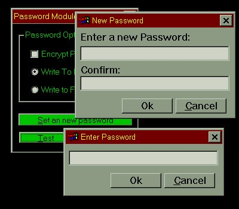



## Complete Password Module \(without additional forms

### Description

This module will lessen the burden of adding password protection to your applications. All windows used by this module are created at runtime using the Win API thanks to Joseph Huntley's APIForm. So there is no need to add forms to your existing project. Simply add the module, a few lines of code, and set the Variable properties.

This module will create two password dialogs. One to set\change passwords, and one to verify the password. All password checking is done inside the module. All you have to do to call and check a password is call two simple functions.

You can choose to have the password encrypted, not encrypted and stored either in a file or in the registry.
 
### More Info
 

             |
---                |---
**Submitted On**   |2000-03-16 02:15:52
**By**             |[dcroft  \<aka gh0ul\>](https://github.com/Planet-Source-Code/PSCIndex/blob/master/ByAuthor/dcroft-aka-gh0ul.md)
**Level**          |Advanced
**User Rating**    |4.7 (42 globes from 9 users)
**Compatibility**  |VB 5\.0, VB 6\.0
**Category**       |[Windows API Call/ Explanation](https://github.com/Planet-Source-Code/PSCIndex/blob/master/ByCategory/windows-api-call-explanation__1-39.md)
**World**          |[Visual Basic](https://github.com/Planet-Source-Code/PSCIndex/blob/master/ByWorld/visual-basic.md)
**Archive File**   |[CODE\_UPLOAD40093162000\.zip](https://github.com/Planet-Source-Code/dcroft-aka-gh0ul-complete-password-module-without-additional-forms__1-6627/archive/master.zip)

